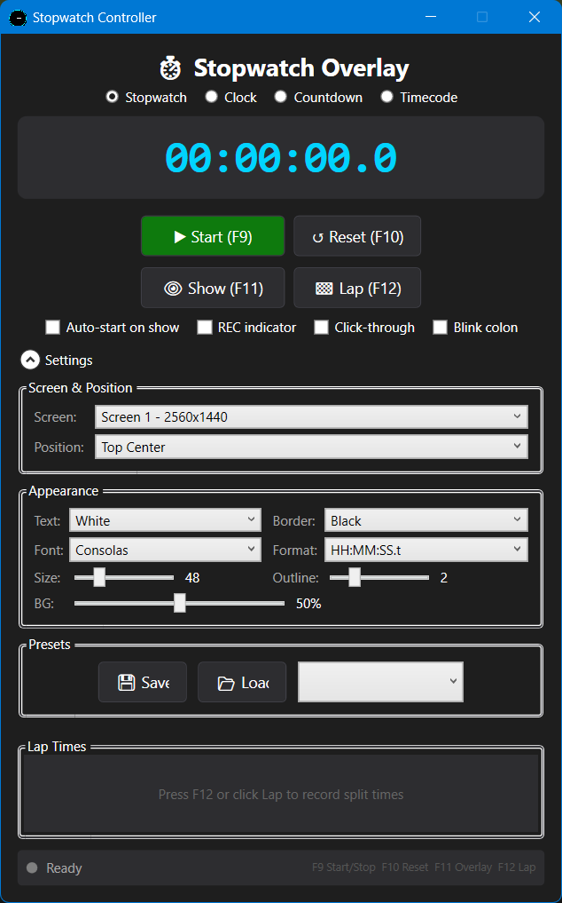

# ⏱️ Stopwatch Overlay

A transparent, always-on-top timer overlay for Windows — perfect for video recordings, live streams, and presentations.

[](https://github.com/clemensv/stopwatch/releases/latest)
[](LICENSE)

**🌐 [Project Website](https://clemensv.github.io/stopwatch/)**

<p align="center">
  
</p>

---

## What It Does

Stopwatch Overlay places a customizable timer on top of all your windows — including fullscreen apps and camera feeds. Control it with global hotkeys so you never have to switch away from what you're recording.

### Features

- ⏱️ **Four modes** — Stopwatch, real-time clock, countdown timer, and frame-accurate timecode
- 🖥️ **Multi-monitor** — Show the overlay on one screen or all screens at once
- 📌 **Always on top** — Stays visible over fullscreen apps, games, and camera feeds
- 🎨 **Fully customizable** — Text color, border, font, size, background opacity
- ⌨️ **Global hotkeys** — F9–F12 work from any application
- 🏁 **Lap times** — Record split times while the timer runs
- 💾 **Presets** — Save and load appearance configurations
- 🔴 **REC indicator** — Optional blinking recording dot
- 🖱️ **Click-through mode** — Overlay doesn't interfere with mouse clicks
- 👻 **Hidden from Alt+Tab** — Keeps your taskbar clean

---

## Download & Install

1. **Download** the latest `StopwatchOverlay-vX.X.X.zip` from the **[Releases page](https://github.com/clemensv/stopwatch/releases/latest)**
2. **Extract** the ZIP to any folder, for example:
   ```
   C:\Tools\StopwatchOverlay\
   ```
3. **Run** `StopwatchOverlay.exe` — no installer needed

> **Tip:** Pin it to your taskbar or create a desktop shortcut for quick access.

### .NET Runtime Requirement

The app requires the .NET 8.0 Desktop Runtime:

| Windows Version | Runtime |
|---|---|
| **Windows 11 24H2+** | ✅ Included — nothing to install |
| **Windows 11 (older)** | Install the [.NET 8.0 Desktop Runtime](https://dotnet.microsoft.com/download/dotnet/8.0/runtime) |
| **Windows 10** | Install the [.NET 8.0 Desktop Runtime](https://dotnet.microsoft.com/download/dotnet/8.0/runtime) |

---

## How to Use

1. Launch **StopwatchOverlay.exe** — the controller window appears
2. Click **▶ Start** (or press **Win+F5**) to start the timer
3. Click **👁 Show** (or press **Win+F7**) to display the overlay on screen
4. Choose your target **screen** and **position** from the dropdowns
5. Customize colors, font, size, and opacity in the **Settings** panel
6. **Drag** the overlay with your mouse for pixel-perfect placement

### Keyboard Shortcuts

| Key | Action |
|---|---|
| **Win+F5** | Start / Stop |
| **Win+F6** | Reset |
| **Win+F7** | Show / Hide overlay |
| **Win+F8** | Record lap time |

### Modes

| Mode | Description |
|---|---|
| **Stopwatch** | Elapsed time with start / stop / reset |
| **Clock** | Real-time clock (optional blinking colon) |
| **Countdown** | Configurable countdown, continues into negative |
| **Timecode** | Frame-accurate display (HH:MM:SS:FF) |

---

## Tips

- The overlay uses a semi-transparent dark background — adjust opacity in Settings
- Text outlines keep the timer readable on any background
- You can hide the overlay while keeping the timer running
- Use **click-through mode** so the overlay doesn't interfere with your work
- Presets are great for switching between different recording setups

---

## For Developers

See [DEVELOPERS.md](DEVELOPERS.md) for build instructions, architecture details, and contribution guidelines.

## License

[MIT](LICENSE)
