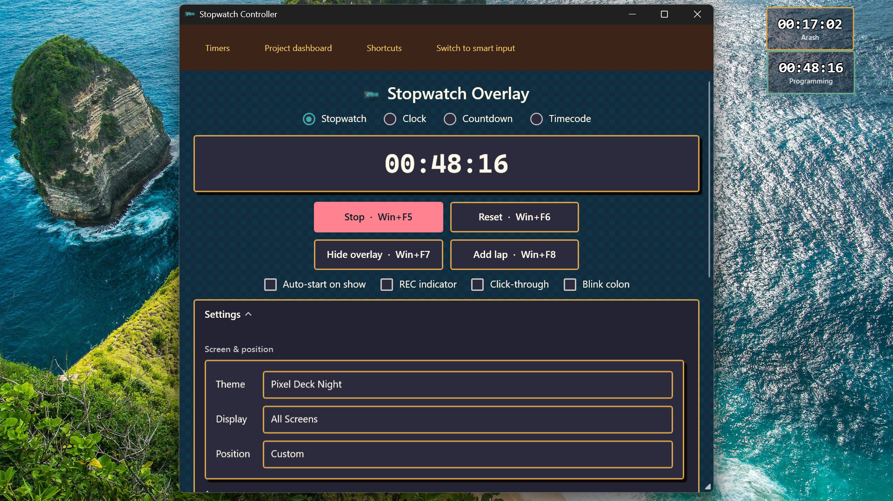

# ⏱️ Stopwatch Overlay

A transparent, always-on-top timer overlay and lightweight project time tracker for Windows — useful for focused work, video recordings, live streams, and presentations.

[](https://github.com/hosseinhayati128/stopwatch/releases/latest)
[](LICENSE)

**🌐 [Project Website](https://clemensv.github.io/stopwatch/)**

<p align="center">
  
</p>

<p align="center">
  
</p>

---

## What It Does

Stopwatch Overlay places customizable timers on top of all your windows — including fullscreen apps and camera feeds. Run several timers independently, assign them to projects, and control the selected timer with global hotkeys without leaving the application where you are working.

### Features

- ⏱️ **Four modes** — Stopwatch, real-time clock, countdown timer (fixed duration or count down to a clock time), and frame-accurate timecode
- 🧩 **Multiple independent timers** — Create several floating timers, keep them running at the same time, and select which one the controls affect
- 🗂️ **Combined timer view** — Press Win+F12 to place all open timers in one shared floating overlay, then use Win+F3 to switch the timer it displays
- 📚 **Project time history** — Assign a timer to an existing or new project and automatically record each work session
- 📊 **Project dashboard** — Review totals, charts, timelines, and individual sessions, then open the records page to add or correct historical time
- 🖥️ **Multi-monitor** — Show the overlay on one screen or all screens at once
- 📌 **Always on top** — Stays visible over fullscreen apps, games, and camera feeds
- 🎨 **Fully customizable** — Text color, border, font, size, background opacity
- ⌨️ **Global hotkeys** — Win+F2 through Win+F12 work from any application and can be customized
- 🔄 **Quick clock toggle** — Switch between the current mode and Clock with Win+F9 or right-click the overlay
- 🏷️ **Project labels** — Choose an existing project or create a new project name for the active timer with Win+F10
- 🖱️ **Overlay controls** — Hover over a timer for close, pause/resume, and reset controls
- 💾 **Automatic recovery** — Restore every timer after a restart, shutdown, or crash; running timers include the time the app was closed
- 🏁 **Lap times** — Record split times while the timer runs
-  **REC indicator** — Optional blinking recording dot
- 🖱️ **Click-through mode** — Overlay doesn't interfere with mouse clicks
- 👻 **Hidden from Alt+Tab** — Keeps your taskbar clean
- 🚀 **Start with Windows** — Optionally launch the overlay automatically when you sign in

---

## Download & Install

1. **Download** the latest Windows ZIP from the **[Releases page](https://github.com/hosseinhayati128/stopwatch/releases/latest)**
2. **Extract** the ZIP to any folder, for example:
   ```
   C:\Tools\StopwatchOverlay\
   ```
3. **Run** `StopwatchOverlay.exe` — no installer needed

> **Tip:** Pin it to your taskbar or create a desktop shortcut for quick access.

### .NET Runtime Requirement

The standard build requires the .NET 10 Desktop Runtime. The portable,
self-contained release includes the runtime and does not require a separate install.

| Windows Version | Runtime |
|---|---|
| **Windows 11** | Install the [.NET 10 Desktop Runtime](https://dotnet.microsoft.com/download/dotnet/10.0/runtime) for the standard build |
| **Windows 10** | Install the [.NET 10 Desktop Runtime](https://dotnet.microsoft.com/download/dotnet/10.0/runtime) for the standard build |
| **Portable release** | No separate runtime required |

---

## How to Use

1. Launch **StopwatchOverlay.exe** — the controller window appears
2. Click **▶ Start** (or press **Win+F5**) to start the timer
3. The overlay is shown automatically; press **Win+F7** whenever you want to hide or show the active timer
4. Choose your target **screen** and **position** from the dropdowns
5. Customize colors, font, size, and opacity in the **Settings** panel
6. **Drag** the overlay with your mouse for pixel-perfect placement

Press **Win+F2** to create another timer. Each timer can run independently. Click an overlay or press **Win+F3** to make that timer active; the regular timer shortcuts then affect only the active timer.

Press **Win+F12** to combine all open timers into one shared floating overlay. **Win+F3** keeps its normal job: it selects the next active timer and the shared overlay updates to show it. Press **Win+F12** again to restore the timers to their previous separate overlays and positions.

Press **Win+F10** to assign the active timer to an existing project or add a new project name. Once that named timer is running, the app records its work time automatically.

### Keyboard Shortcuts

| Key | Action |
|---|---|
| **Win+F2** | Create a new timer and make it active |
| **Win+F3** | Select the next active timer |
| **Win+F4** | Close the active timer |
| **Win+F5** | Start / stop the active timer |
| **Win+F6** | Reset the active timer |
| **Win+F7** | Show / hide the active timer's overlay, or the shared overlay in combined mode |
| **Win+F8** | Record a lap for the active timer |
| **Win+F9** | Switch the active timer between its current mode and Clock |
| **Win+F10** | Choose, create, change, or clear the active timer's project |
| **Win+F11** | Open the project time dashboard |
| **Win+F12** | Combine all open timers into one shared overlay / restore separate overlays |

Clicking an overlay selects its timer. Hovering over an interactive overlay reveals close, pause/resume, and reset buttons. When **click-through mode** is enabled, mouse interaction with overlays—including selection, dragging, and hover controls—is disabled; global keyboard shortcuts continue to work.

### Project time tracking

A timer's optional name is also its **project name**. Use **Win+F10** to select a project used before or add a new name. Starting a named timer begins a work session for that project. Pausing, stopping, closing, or clearing the project ends its current session; changing a running timer to another project ends the old session and begins the new one at the same moment.

Open the dashboard with **Win+F11**. Its **Today**, **Last 7 days**, **Last 30 days**, and **All time** views include:

- total tracked time, session count, project count, and currently active sessions
- horizontal time-by-project bars and daily totals
- a 24-hour project timeline for each local calendar day
- individual work sessions grouped by date, including their start time, end time, and duration

Use the dashboard's **Project** filter to switch every card, chart, timeline, and session list between **All projects** and one specific project.

The dashboard's **Project records** card opens a dedicated records page. There you can filter the complete history by project, inspect exact local start/end times and durations, add a past work record manually, or edit any completed record. A currently running record remains visible but is locked; pause its timer first if you need to correct it. Manual changes use the same crash-safe project-history storage as automatically tracked sessions.

Every timer is tracked independently, so separately running project timers can record overlapping sessions. Dashboard timer-time totals add simultaneous sessions together rather than de-duplicating them. Unnamed timers continue to work normally but do not add project history.

Project history is saved locally under `%APPDATA%\StopwatchOverlay` and survives application restarts, computer shutdowns, and crashes. A named timer that is restored in its running state continues the same work session across the time the app was closed.

### Automatic recovery

The app restores all timer sessions when it starts again, including their running or paused state, names, laps, modes, overlay visibility and positions, combined/separate presentation, and the active timer. Timers that were running continue to account for the time while the app or PC was off; paused timers return at their exact saved time.

Recovery and project-history data are stored locally under `%APPDATA%\StopwatchOverlay`. Important actions are checkpointed immediately, while pending text, slider, and checkbox edits are written atomically by a one-second save timer. The timer does not keep writing while nothing has changed. After an abrupt process or power failure, at most roughly one second of the latest UI edits may be missing.

### Modes

| Mode | Description |
|---|---|
| **Stopwatch** | Elapsed time with start / stop / reset |
| **Clock** | Real-time clock (optional blinking colon) |
| **Countdown** | Counts down by a fixed duration, or to a wall-clock time (HH:MM:SS) via the Duration / Until-clock-time toggle; continues into negative. Also supports **smart text input** (see below) |
| **Timecode** | Frame-accurate display (HH:MM:SS:FF) |

### Smart countdown input

In Countdown mode, use the menu (**Switch to smart input** / **Switch to classic input**) to swap the spinner boxes for a single text field that parses natural durations, times, and dates. The choice is remembered between launches, and a live preview shows the interpreted result as you type.

**Durations**

| Type | Examples |
|---|---|
| Plain number = minutes | `5` → 5 min |
| Units (singular, plural, short) | `30 seconds`, `5m`, `7 hours`, `3d`, `25 weeks`, `6mo`, `2 years` |
| Combined | `5 minutes 30 seconds`, `1h30m`, `7h15m` |
| Decimal (with a unit) | `5.5 minutes` → 5m30s, `1.5 hours`, `0.5 years` → 6 months |
| Colon / dot separator | `5:30` → 5m30s, `7:15:00`, `5.30`, `7.15.00` |

**Times of day** (counts down to the next occurrence; rolls to tomorrow if already passed)

| Type | Examples |
|---|---|
| 12-hour meridiem | `2 pm`, `2:30 pm`, `2:30:15 pm`, `5am` (no space) |
| 24-hour (needs a clock prefix) | `until 14:30`, `till 9:00`, `c 20:30`, `wc 20h30`, `c 20h` |

**Dates & weekdays** (a bare date with no time = midnight)

| Type | Examples |
|---|---|
| Relative | `today`, `tomorrow` |
| Weekday (next occurrence) | `monday`, `mon`, `wednesday`, `wed` |
| Calendar date | `january 1`, `jan 1`, `1 january`, `1 jan`, `1/1`, `01/01` |
| Date + time (either order) | `jan 1 at 2 pm`, `2 pm on january 1`, `tomorrow 9 am`, `2 pm wednesday` |

> The `c` / `wc` / `until` / `till` prefixes force clock-time reading, so a bare `20:30` (a duration = 20m30s) can be entered as a 20:30 clock time via `c 20:30`.

---

## Tips

- The overlay uses a semi-transparent dark background — adjust opacity in Settings
- Text outlines keep the timer readable on any background
- You can hide the overlay while keeping the timer running
- Multiple timers can continue counting at the same time; "active" only means the one that receives commands
- Use **click-through mode** so the overlay doesn't interfere with your work; use hotkeys to control it while click-through is enabled

---

## For Developers

See [DEVELOPERS.md](DEVELOPERS.md) for build instructions, architecture details, and contribution guidelines.

## License

[MIT](LICENSE)
