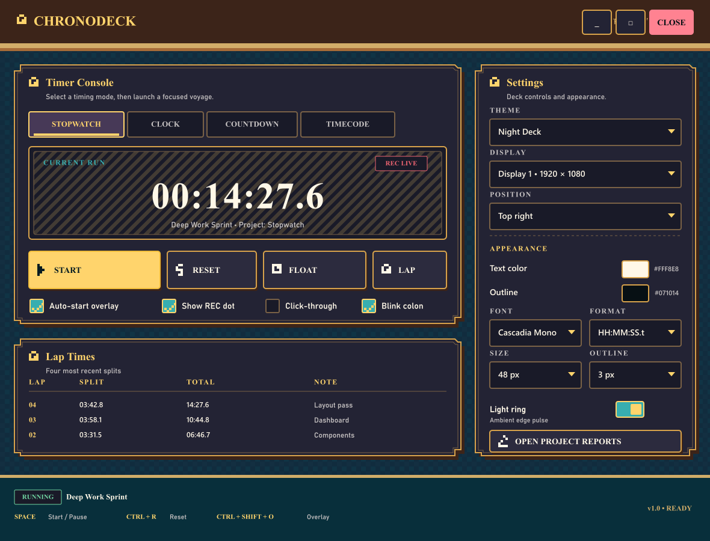

# ⏱️ Stopwatch Overlay

A transparent, always-on-top timer overlay for Windows — perfect for video recordings, live streams, and presentations.

[](https://github.com/hosseinhayati128/stopwatch/releases/latest)
[](LICENSE)

**🌐 [Project Website](https://clemensv.github.io/stopwatch/)**

<p align="center">
  
</p>

---

## What It Does

Stopwatch Overlay places a customizable timer on top of all your windows — including fullscreen apps and camera feeds. Control it with global hotkeys so you never have to switch away from what you're recording.

### Features

- ⏱️ **Four modes** — Stopwatch, real-time clock, countdown timer (fixed duration or count down to a clock time), and frame-accurate timecode
- 🖥️ **Multi-monitor** — Show the overlay on one screen or all screens at once
- 📌 **Always on top** — Stays visible over fullscreen apps, games, and camera feeds
- 🎨 **Fully customizable** — Text color, border, font, size, background opacity
- ⌨️ **Global hotkeys** — Win+F5 through Win+F9 work from any application and can be customized
- 🔄 **Quick clock toggle** — Switch between the current mode and Clock with Win+F9 or right-click the overlay
- 🏁 **Lap times** — Record split times while the timer runs
-  **REC indicator** — Optional blinking recording dot
- 🖱️ **Click-through mode** — Overlay doesn't interfere with mouse clicks
- 👻 **Hidden from Alt+Tab** — Keeps your taskbar clean
- 🚀 **Start with Windows** — Optionally launch the overlay automatically when you sign in

---

## Download & Install

1. **Download** the latest Windows ZIP from the **[Releases page](https://github.com/hosseinhayati128/stopwatch/releases/latest)**
2. **Extract** the ZIP to any folder, for example:
   ```
   C:\Tools\StopwatchOverlay\
   ```
3. **Run** `StopwatchOverlay.exe` — no installer needed

> **Tip:** Pin it to your taskbar or create a desktop shortcut for quick access.

### .NET Runtime Requirement

The app requires the .NET 8.0 Desktop Runtime:

| Windows Version | Runtime |
|---|---|
| **Windows 11 24H2+** | ✅ Included — nothing to install |
| **Windows 11 (older)** | Install the [.NET 8.0 Desktop Runtime](https://dotnet.microsoft.com/download/dotnet/8.0/runtime) |
| **Windows 10** | Install the [.NET 8.0 Desktop Runtime](https://dotnet.microsoft.com/download/dotnet/8.0/runtime) |

---

## How to Use

1. Launch **StopwatchOverlay.exe** — the controller window appears
2. Click **▶ Start** (or press **Win+F5**) to start the timer
3. Click **👁 Show** (or press **Win+F7**) to display the overlay on screen
4. Choose your target **screen** and **position** from the dropdowns
5. Customize colors, font, size, and opacity in the **Settings** panel
6. **Drag** the overlay with your mouse for pixel-perfect placement

### Keyboard Shortcuts

| Key | Action |
|---|---|
| **Win+F5** | Start / Stop |
| **Win+F6** | Reset |
| **Win+F7** | Show / Hide overlay |
| **Win+F8** | Record lap time |

### Modes

| Mode | Description |
|---|---|
| **Stopwatch** | Elapsed time with start / stop / reset |
| **Clock** | Real-time clock (optional blinking colon) |
| **Countdown** | Counts down by a fixed duration, or to a wall-clock time (HH:MM:SS) via the Duration / Until-clock-time toggle; continues into negative. Also supports **smart text input** (see below) |
| **Timecode** | Frame-accurate display (HH:MM:SS:FF) |

### Smart countdown input

In Countdown mode, use the menu (**Switch to smart input** / **Switch to classic input**) to swap the spinner boxes for a single text field that parses natural durations, times, and dates. The choice is remembered between launches, and a live preview shows the interpreted result as you type.

**Durations**

| Type | Examples |
|---|---|
| Plain number = minutes | `5` → 5 min |
| Units (singular, plural, short) | `30 seconds`, `5m`, `7 hours`, `3d`, `25 weeks`, `6mo`, `2 years` |
| Combined | `5 minutes 30 seconds`, `1h30m`, `7h15m` |
| Decimal (with a unit) | `5.5 minutes` → 5m30s, `1.5 hours`, `0.5 years` → 6 months |
| Colon / dot separator | `5:30` → 5m30s, `7:15:00`, `5.30`, `7.15.00` |

**Times of day** (counts down to the next occurrence; rolls to tomorrow if already passed)

| Type | Examples |
|---|---|
| 12-hour meridiem | `2 pm`, `2:30 pm`, `2:30:15 pm`, `5am` (no space) |
| 24-hour (needs a clock prefix) | `until 14:30`, `till 9:00`, `c 20:30`, `wc 20h30`, `c 20h` |

**Dates & weekdays** (a bare date with no time = midnight)

| Type | Examples |
|---|---|
| Relative | `today`, `tomorrow` |
| Weekday (next occurrence) | `monday`, `mon`, `wednesday`, `wed` |
| Calendar date | `january 1`, `jan 1`, `1 january`, `1 jan`, `1/1`, `01/01` |
| Date + time (either order) | `jan 1 at 2 pm`, `2 pm on january 1`, `tomorrow 9 am`, `2 pm wednesday` |

> The `c` / `wc` / `until` / `till` prefixes force clock-time reading, so a bare `20:30` (a duration = 20m30s) can be entered as a 20:30 clock time via `c 20:30`.

---

## Tips

- The overlay uses a semi-transparent dark background — adjust opacity in Settings
- Text outlines keep the timer readable on any background
- You can hide the overlay while keeping the timer running
- Use **click-through mode** so the overlay doesn't interfere with your work

---

## For Developers

See [DEVELOPERS.md](DEVELOPERS.md) for build instructions, architecture details, and contribution guidelines.

## License

[MIT](LICENSE)
